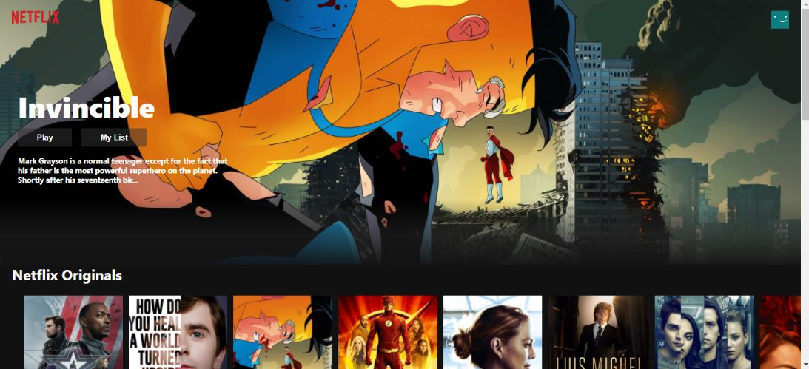
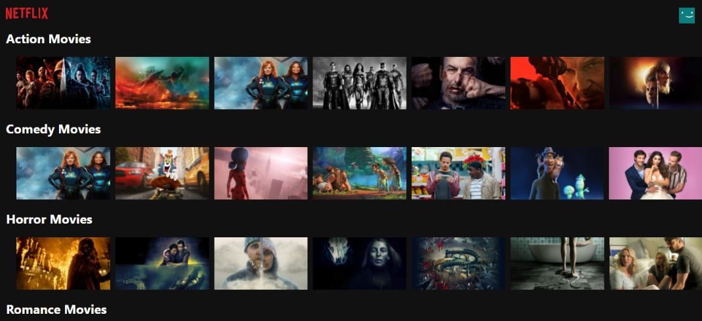
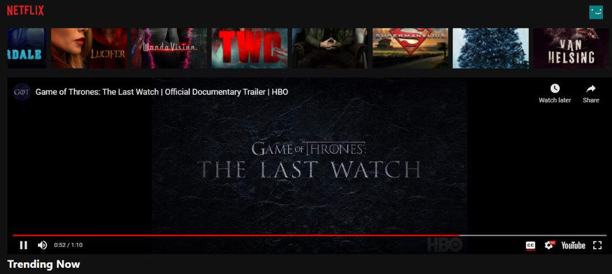

If you want to have a demo of this project please visit, 
https://netflix-clone-7bb1c.web.app/

# Tools Used?
1) React
2) CSS
3) axios

# How to run the project locally?
1) npm install - Installs all the dependencies required
2) Get your API Key from https://www.themoviedb.org/documentation/api
3) Navigate to requests.js and replace API_KEY
4) npm start - Runs the project 

# How to get your TMDb API Key?
1) Signup for an account if you don't have one
2) Verify your email and re-enter your details
3) Request for an API Key 
4) Go to Developer and accept all the T&Cs
5) Copy the API Key (v3 Auth)
6) With the Example API Request and your API Key, test the request in Postman.
7) And it's done! Congrats.

# User Stories Offered?
1) Responsive
2) Click on a movie, a trailer plays (using the npm package movie-trailer)
3) Trending Now updates weekly

# Screenshots of the Project

# Future Scope of the Project
1) Implement search for Movies and TV Shows.
2) Upon hovering, display the details of the Movie/TV Show - Overview, Initial Release etc
